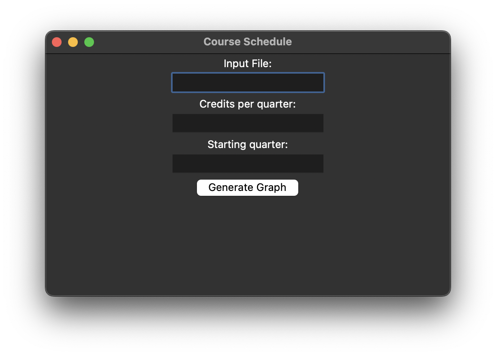

# Major Schedule Generator
A work by: Raj Dhillon and Case Wright

One of the most difficult parts of completing your major is deciding on your schedule. There are a plethora of courses, with each being offered at different parts of the year. This makes crafting a schedule that fits your needs extremely difficult, with you having to ensure that all your classes align with your starting quarter and fit your credit goals while also ensuring that you complete them within a reasonable time period. A solution to this problem is to use a program to generate your class schedule after inputting your constraints along with the classes you want to take. This ensures that you're able to take the classes you want alongside those that are mandatory in the most efficient manner possible.

## Description
Our project aims to provide a means of generating a class schedule from your preferred classes, credit constraints, and starting quarter to allow you to complete your degree as efficiently as possible. This project was developed using Python, and at the bare minimum requires the user to provide a csv file with all the classes that they need to take to graduate. From this, our program will prompt the user for any credit or quarter constraints, afterwhich it will provide you with a text file containing your potential schedule along with a visual course sequence that you can follow.

## Requirements

### CSV file info
1. Only add prerequisites that are required in the major's prerequisite slot. For example, if it is not in the list of classes to take, do not added to the column on the csv for prerequisites. (If the class is in the column for prerequisites for a course, it MUST be included as a course to take.)  
**The prerequisite column MUST match the list of courses to take in the CSV.** 
2. Only add the class sequences you plan to take. For example, you are required to take a science sequence of either physics, biology or chemistry. Choose the sequence you would like to take, add the three courses required for that sequence and omit the other two sequences. 
3. This program assumes that general education classes have already been taken. However, if you would like to include general education classes in the CSV, our program will work for them, as long as you follow the requirements listed in this section. 
4. If you are a transfer student and must take transfer course alternatives to the traditional classes, please only include the transfer student course in the file as opposed to the traditional course. Including in the prerequisite section of courses. For example, if you will take Data structures I for transfer students, replace every instance of DSI regular with DSI Transfer. 
5. This program only works for full time schedules. So you must take 12 to 18 credits per quarter. 
6. Ensure that the courses you add to the csv file are enough to fulfill the credits for your major. Example, only add enough electives to fulfill your major requirements, any extra electives will be assigned to the schedule even if they theoretically aren't required. 

### General
This program requires Python 3.11 and tkinter to run, along with the installation of some Python libraries. These libraries include: matplotlib (version 3.5.1) and networkx (version 3.0).The program has also been tested to run on Windows, macOS, and Ubuntu.  
To install Python 3.11, you can use `sudo apt install python3.11`  
To install the additional libraries, you can use the command `pip install -r requirements.txt`. This will install the requirements listed above (matplotlib, and networkx). For this to work, you will need pip installed. If you do not have it installed, you can install it with `sudo apt install python3-pip`.   
tkinter should be installed with Python, but you can install it manually by running `sudo apt install python3-tk`

## User Manual

### Video showing program in action
[Product Demonstration](https://youtu.be/8mXu9EuWoQM)

### Run with no constraints
1. Head to the directory where you cloned the repo folder. 
2. Open the cloned repo folder. 
3. Open a terminal and set the directory to that of the cloned repo. 
4. Use "python3 driver.py" to run the program in the terminal. 
5. Confirm the presence of the UI window. 
6. Enter the name of the file with course requirements and run, opting for no constraints. 
7. Read the instructions for exiting fullscreen and confirm. 
8. A visual schedule is shown. 
9. A text file with the course schedule is saved in the folder. 

### Run with only credit constraint
1. Enter a file name along with credit limit (between 12-18). 
2. Run the program, and look at the adjusted graph. 

### Run with only quarter constraint
1. Enter a file name along with quarter constraint (between 1-3). 
2. Run the program, and look at the adjusted graph. 

### Run with credit and quarter constraint
1. Enter a file name along with the credit and quarter constraints. 
2. Run the program, and look at the adjusted graph. 

## Reflection
This project was a fantastic learning experience, and had many frustrating experiences, followed by moments of pure joy when something finally worked after hours, or even days, of repeated failure. While the initial thought was that this project would test our knowledge of graphs that we have covered in class, it also incorporated some of the other topics we covered, such as greedy algorithms. 

As with most team projects, one of the most essential steps that we took to successfully complete this project was maintaining excellent communication. We were able to maintain a clear line of communication, where we shared our thoughts and ideas on the project, and ensured we were on the same page. While we did a great job of communicating our ideas, we faced some difficulties ensuring we both knew what parts of the project were left to be completed, and which parts were already done. In response to this, we created a Kanban board using Microsoft Planner. This allowed us to visualize our progress and ensure that all the crucial parts of the project were being completed, and by whom.

Logistical challenges aside, the project also had some unique technical difficulties that were not obvious until they would come to light amid implementation. One of these major difficulties was deciding how to implement a system where the program could detect and choose the required number of electives from the major list. While we considered adding another column to the csv file for the required credits for each major course category, it became clear that it would be very difficult to create a system that works for a variety of majors. We then decided to instruct the user to only include the courses that they were interested in and fulfilled their major requirements. By shifting this process to the user, we were able to avoid unnecessary columns in the csv file and keep the program modular for all kinds of majors.

Later we would also discover the complexity of creating a visual for our graph. Although understanding the NetworkX library to help create our graph was a time-consuming task, we would later discover that plotting that graph would be even more difficult. Many different methods of graphing were experimented with, but many resulted in a graph without the structure necessary to clearly depict the progression of quarters. In the end, we used Matplotlib to have precise control over the placement of each node on the graph visual. However, it would then have issues of its own. 

While we both had divided up the projects into individual separate parts, the ability to collaborate over call was crucial in getting past the technical hang-ups. By having another set of eyes, we were able to discover ways to address library related issues and explain to the other what a specific piece of code was doing.

Ultimately, we learned a lot from this project, ranging from the ability to deal with technical difficulties to also establishing a clear protocol for logistics. It also became an eye opener to the necessity of leveraging your teammates. Where it may take you days to understand why a certain bug is occurring, a different set of eyes from another teammate could help reduce that time to only a couple of hours, or even minutes.
